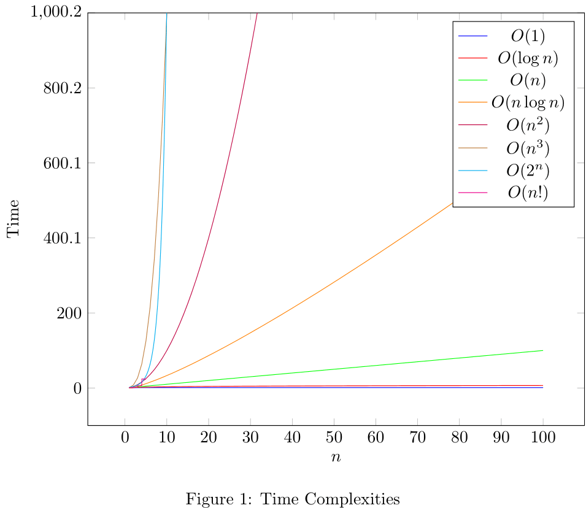

Categorizes algorithms on time/memory based on input.

## Why?

-   Helps us make decisions on what data structures and algorithms to use.

## Fundamental concept

As input grows, how fast does computation or memory grow?

## Important concepts

### Growth is **with respect to input**.

```rust
fn sum_char_codes(input: String) -> u32 {
    let mut i = 0;
    for char in input.chars() {
        i += char as u32;
    }
    i
}
```

It runs an iteration in the `for` loop for the length of the string.
This function has $O(n)$ time complexity.

(Generally, look for loops to determine time complexity)

### You always drop constants

$$
O(k\cdot n) \longrightarrow O(n)
$$

While **practically important**, they're not **theoretically important**.

For example, if comparing $$O(10n)$$ and $$O(n^2)$$:

| $$n$$    | $$O(10n)$$ | $$O(n^2)$$                   |
| -------- | ---------- | ---------------------------- |
| $$1$$    | $$10$$     | $$1$$                        |
| $$5$$    | $$50$$     | $$25$$                       |
| $$100$$  | $$1000$$   | $$10000$$ (10x bigger)       |
| $$1000$$ | $$10000$$  | $$1000000$$ (100x bigger)    |
| $10000$$ | $$100000$$ | $$100000000$$ (1000x bigger) |

We're not concerned with the exact time, but instead, _how_ it grows.

#### Practical and theoretical differences

Just because $$O(n)$$ is faster than $$O(n^2)$$ doesn't mean it's always better.

Remember, we drop constants. Therefore, $$O(100n)$$ is faster than $$O(n^2)$$ but in the practical sense, it's slower for small inputs.

For example, in sorting algorithms, we use insertion sort for small inputs. Though slower in the theoretical sense because it's $$O(n^2)$$, it's faster in the practical sense because it's faster **for small inputs** than for example, quicksort which is $$O(n\log n)$$.

### Consider the worst-case scenario

```rust
fn sum_char_codes(input: String) -> u32 {
    let mut i = 0;
    for char in input.chars() {
        if char == 'E' { // checks if char is 'E', then instantly breaks
            return i;
        }
        i += char as u32;
    }
    i
}
```

This function _still_ has $$O(n)$$ time complexity because we're looking for the worst-case scenario.

While there are some algorithms where it's better to reason using the best case and the average case, most of the time, we're concerned with the worst-case scenario.

In interviews, almost always assume the worst-case scenario.

## Common Big-O runtimes

| Big-O          | Name        | Example               | Notes     |
| -------------- | ----------- | --------------------- | --------- |
| $$O(1)$$       | Constant    | Hash table lookup     | Fastest   |
| $$O(log n)$$   | Logarithmic | Binary search         | Fast      |
| $$O(n)$$       | Linear      | Simple search         | Slow      |
| $$O(n \textrm{log} n)$$ | Log-linear  | Quicksort             | Fast      |
| $$O(n^2)$$     | Quadratic   | Selection sort        | Slow      |
| $$O(n^3)$$     | Cubic       | Matrix multiplication | Slow      |
| $$O(2^n)$$     | Exponential | Traveling salesperson | Very slow |
| $$O(n!)$$      | Factorial   | Traveling salesperson | Very slow |



### Simple examples

#### $$O(n^2)$$

```rust
fn sum_char_codes(input: String) -> u32 {
    let mut i = 0;
    for char in input.chars() { // loop 1
        for char in input.chars() { // loop 2
            i += char as u32;
        }
    }
    i
}
```

For each character in the string, we iterate through the string again. This is $$O(n^2)$$.

#### $$O(n^3)$$

```rust
fn sum_char_codes(input: String) -> u32 {
    let mut i = 0;
    for char in input.chars() { // loop 1
        for char in input.chars() { // loop 2
            for char in input.chars() { // loop 3
                i += char as u32;
            }
        }
    }
    i
}
```

Just like the previous example, but we iterate through the string three times. This is $$O(n^3)$$.

#### $$O(n \textrm{log} n)$$

(Quicksort) - will be covered in a later section.

#### $$O(\textrm{n})$$

Binary search trees.

## $$O(\sqrt{n})$$

This is a very unique time complexity.

## Other notations

### $$\Omega$$

$$\Omega$$ is the **lower bound** of an algorithm.

For example, $$\Omega(n)$$ means that the algorithm will take at least $$n$$ time.

### $$\Theta$$

$$\Theta$$ is the **tight bound** of an algorithm.

For example, $$\Theta(n)$$ means that the algorithm will take at least $$n$$ time and at most $$n$$ time.

## Space complexity

Space complexity is the amount of memory an algorithm takes up. Generally it's less consequential than time complexity.

```tsx
return <Component {...props} /> // O(n) time and O(n) space
```

## Conclusion

- Big-O is a way to categorize algorithms based on time/memory.
- Growth is with respect to input.
- You always drop constants.
- In most cases consider the worst-case scenario.
